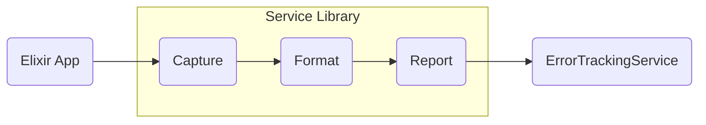
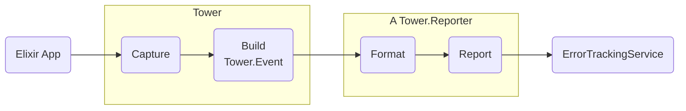
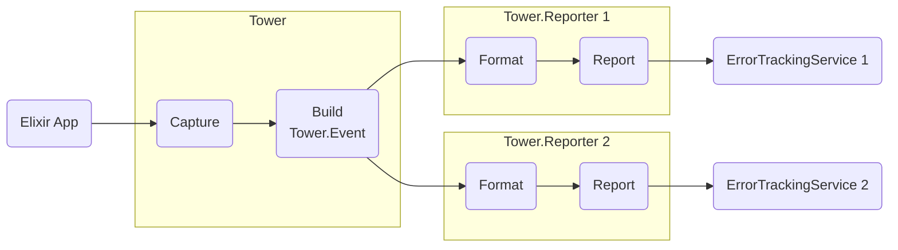

# 🏰 Tower

[](https://github.com/mimiquate/tower/actions?query=branch%3Amain)
[](https://hex.pm/packages/tower)
[](https://hexdocs.pm/tower)

Tower is a flexible exception tracker for elixir applications.

It **listens** for **exceptions** in an elixir application **and informs** about them to
the configured list of **reporters** (one or many).

Any captured exception by `Tower` will be passed along to the list of
configured reporters, which can be set using the `:reporters` config key. For example:

```elixir
config :tower, :reporters, [TowerEmail]
```

You can pick any of the following reporters or [build your own](https://hexdocs.pm/tower/Tower.html#module-writing-a-custom-reporter).


Report to | Tower reporter | Package dependency
:-----| :---------------| :---------
In memory | `Tower.EphemeralReporter` | Built-In
Transactional E-mail | `TowerEmail` | [tower_email]
[Slack.com](https://slack.com) [Webhook](https://api.slack.com/messaging/webhooks) | `TowerSlack` | [tower_slack]
Self-hosted [ErrorTracker](https://github.com/elixir-error-tracker/error-tracker) | `TowerErrorTracker` | [tower_error_tracker]
[BugSnag.com](https://bugsnag.com) | `TowerBugsnag` | [tower_bugsnag]
[Honeybadger.io](https://honeybadger.io) | `TowerHoneybadger` | [tower_honeybadger]
[Rollbar.com](https://rollbar.com) | `TowerRollbar` | [tower_rollbar]
[Sentry.io](https://sentry.io) | `TowerSentry` | [tower_sentry]

[tower_bugsnag]: https://github.com/mimiquate/tower_bugsnag
[tower_email]: https://github.com/mimiquate/tower_email
[tower_error_tracker]: https://github.com/mimiquate/tower_error_tracker
[tower_honeybadger]: https://github.com/mimiquate/tower_honeybadger
[tower_rollbar]: https://github.com/mimiquate/tower_rollbar
[tower_sentry]: https://github.com/mimiquate/tower_sentry
[tower_slack]: https://github.com/mimiquate/tower_slack

Community supported:

- [`ivanhercaz/tower_telegram`](https://github.com/ivanhercaz/tower_telegram)

Follow each reporter's README to get `Tower` installed and configured properly.

## Motivation

> Decoupled error capturing and error reporting in Elixir.

Say you need to add error tracking to your elixir app:

  - You decide what service you will use to send your errors to
  - You look for a good elixir library for that service
  - You configure it, deploy and start receiving errors there

Normally these libraries have to take care of a few responsibilities:

1. Capturing of errors (specific to language and runtime, i.e. Elixir and BEAM)
    - Automatic capturing via (at least one of):
        - Logger backend
        - Logger handler
        - Error logger handler
        - Telemetry event handler
        - Plugs
    - Manual capturing by providing a few public API functions the programmer to call if needed
1. Transform these errors into some format for the remote service (specific to remote service), e.g.
    - JSON for an HTTP API request
    - Subject and body for an e-mail message
1. Make a remote call (e.g. an HTTP request with the payload) to the remote service (specific to remote service)



`Tower`, instead, takes care of capturing errors (number 1), giving them a well defined shape (`Tower.Event` struct)
and pass along this event to pre-configured but separate reporters which take care of the error reporting steps
(number 2 and 3) depending on which service or remote system they report to.



### Consequences of this approach

#### 1. Capture once, report many

You can capture once and report to as many places as you want.

Possibly most will end up with just one reporter. But that doesn't mean you shouldn't be able to
easily have many, either temporarily or permanently if you need it.

Maybe you just need to have a backup in case one service goes downs or something unexpected happens.

Maybe you're trying out different providers and you want to report to the two for a while and compare
how they work, what features they have and how they display the information for you.

Maybe you're planning to switch, and you want to configure the new one without stopping to report to the
old one, at least for a while.



#### 2. Ease of switching services

You can switch from Error Tracking service provider without making any changes to your application error
capturing configuration or expect any change or regression with respect with capturing behavior.

You switch the reporter package, but tower still part of your application, and all the configuration specific
to tower and error capturing tactics is still valid and unchanged.

#### 3. Response to changes in Elixir and BEAM

Necessary future changes caused by deprecations and/or changes in error handling behavior in the BEAM or Elixir can be just
made in `Tower` without need to change any of the service specific reporters.

## Configuration

### `reporters`

List of reporters Tower should report events to.

Default: `[Tower.EphemeralReporter]`

Example:

```elixir
config :tower, reporters: [TowerEmail]
```

### `log_level`

`Logger` messages this level and above will be reported.

Possible values are any of defined `Logger` levels (https://hexdocs.pm/logger/Logger.html#module-levels) or
`:none` to disable reporting of `Logger` messages.

Default: `:critical`

Example:

```elixir
config :tower, log_level: :error
```

### `ignored_exceptions`

List of exceptions that Tower should ignore and not report.

Default: `[]`

Example:

```elixir
config :tower, ignored_exceptions: [DBConnection.ConnectionError]
```

### `logger_metadata`

List of keys that Tower should pick up from the current process `Logger.metadata` when reporting events.

Default: `[]`

Example:

A common use case is setting `Logger.metadata(user_id: user.id)` at the start of your plugs or controller actions and
configure Tower:

```elixir
config :tower, logger_metadata: [:user_id]
```

so that it's included in the reported exception or message event as extra metadata.

Also if using Phoenix you can

```elixir
config :tower, logger_metadata: [:request_id]
```

so that you can co-relate your exceptions reports to the request id in your application logs.

More about Logger metadata:
 - https://hexdocs.pm/logger/Logger.html#module-metadata
 - https://hexdocs.pm/logger/Logger.html#metadata/1

## License

Copyright 2024 Mimiquate

Licensed under the Apache License, Version 2.0 (the "License");
you may not use this file except in compliance with the License.
You may obtain a copy of the License at

    http://www.apache.org/licenses/LICENSE-2.0

Unless required by applicable law or agreed to in writing, software
distributed under the License is distributed on an "AS IS" BASIS,
WITHOUT WARRANTIES OR CONDITIONS OF ANY KIND, either express or implied.
See the License for the specific language governing permissions and
limitations under the License.
